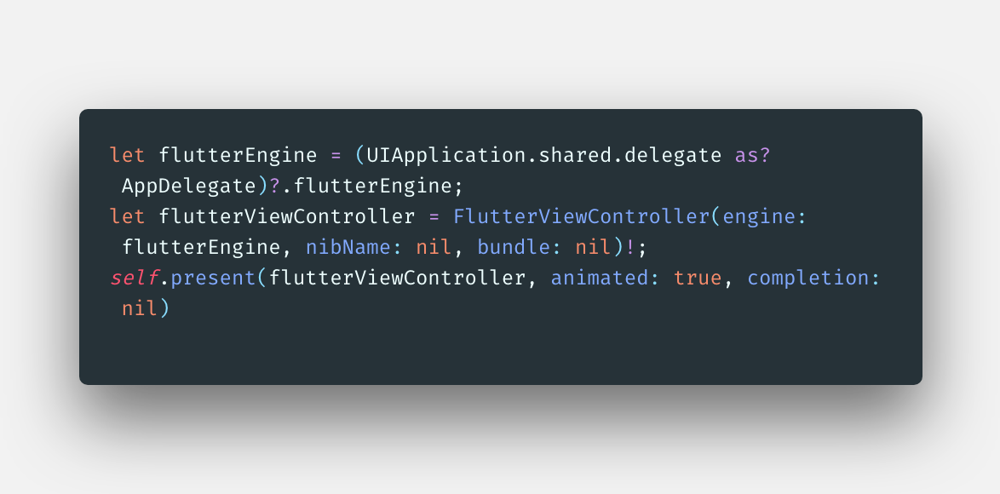
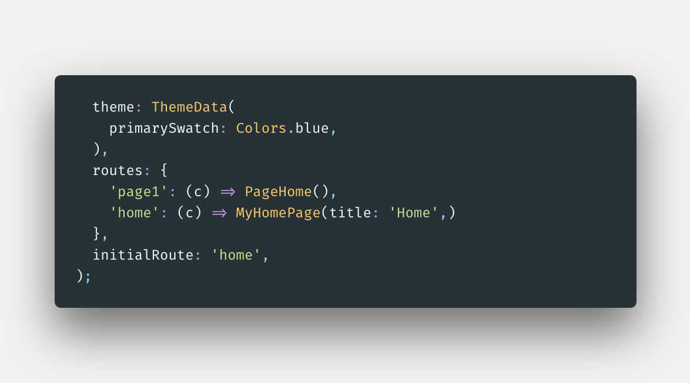
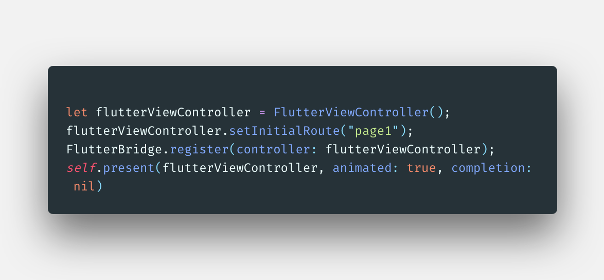
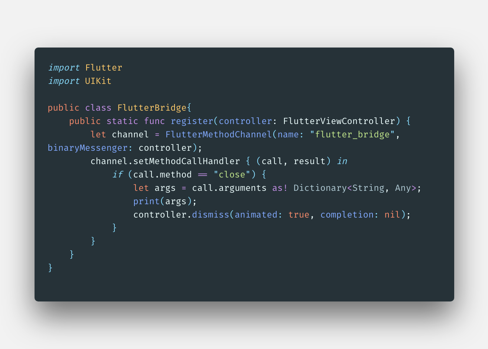
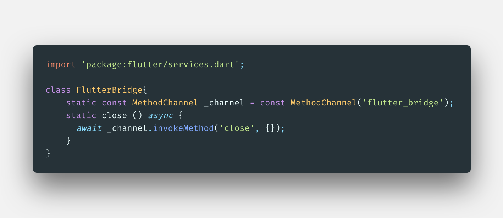
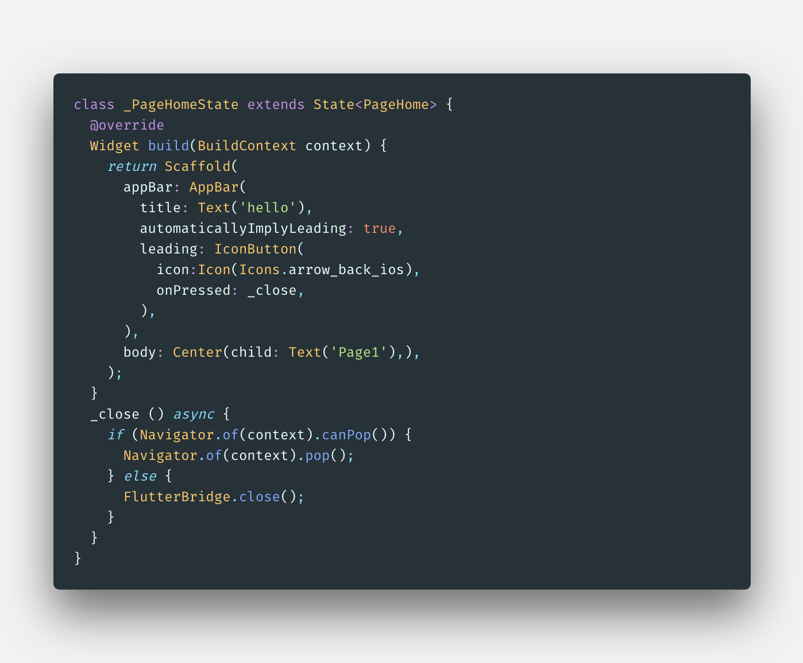

### Swift与Flutter

在使用flutter之前我们一般已经存在了iOS或者android项目，很少会之间使用flutter create创建的项目，

这样就产生了几个需求，1：flutter内可以配置路由，我们怎样iOS页面打开flutter呢；2: 我们怎样打开指定

的fluuter router页面呢；3: 我们怎样过去flutter页面或者与ios页面怎样交互呢，本文一一介绍。

#### 1. iOS打开flutter page

对于存在的iOS项目怎样与flutter继承，本文不再介绍，如果不了解可以看[Add-Flutter-to-existing-apps](https://github.com/flutter/flutter/wiki/Add-Flutter-to-existing-apps)。

打开很简单类似如下代码：



```swift
let flutterEngine = (UIApplication.shared.delegate as? AppDelegate)?.flutterEngine;
let flutterViewController = FlutterViewController(engine: flutterEngine, nibName: nil, bundle: nil)!;
self.present(flutterViewController, animated: true, completion: nil)

```

这里就不再详细介绍。

#### 2. 打开指定router

 通常我们打开页面时并不希望先进入默认首页再进入详情页或者别的页面，希望直接进入特定页面。比如如下flutter router片段：



默认是home页面，但是再iOS swift代码中我们想直接打开page1，要怎样做呢？代码如下：



上面就OK了，那么我们怎样关闭flutter viewcontroller呢？

#### 3. 关闭flutter页面

我们在flutter中打开一个页面时通常`Navigator.of(context).pop();`就能关闭页面，但是我们现在要关闭flutter容器。这里就需要MethodChannel功能了。这里我们封装一个flutter MethodChannel。swift代码如下：



使用时也简单，在2中的第二张图中`FlutterBridge.register(controller: flutterViewController);`这句即可，当然也可以传递参数从`call.arguments`中获取。flutter中封装一下，如下:



调用代码如下：



注意上面的`automaticallyImplyLeading: true` 以及leading部分，就是back button，但是注意_close部分的实现，由于页面可能是flutter容器其他页面push打开的，我们需要判断`Navigator.of(context).canPop()` 如果为真，我们只需要`Navigator.of(context).pop();` 否则直接`FlutterBridge.close();` 关闭flutter viewcontroller。iOS与fluter页面的通信MethodChannel基本使用就说到这里, 如果需要监听事件就需要EventChannel了。

完。

 